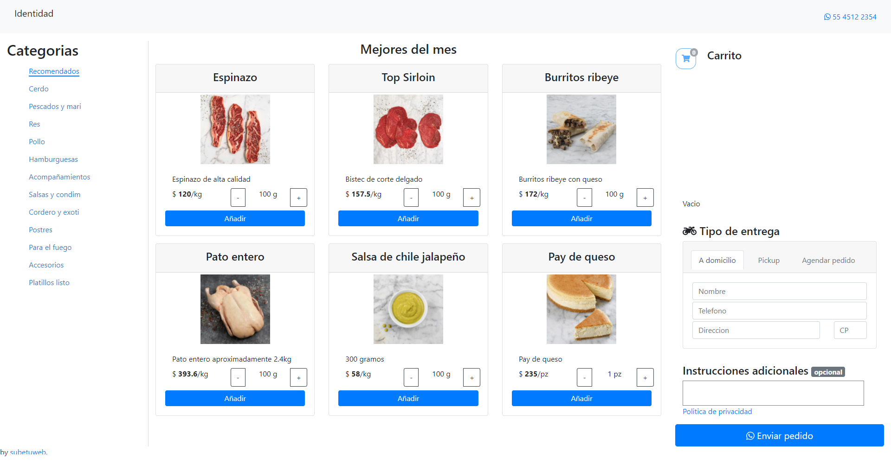
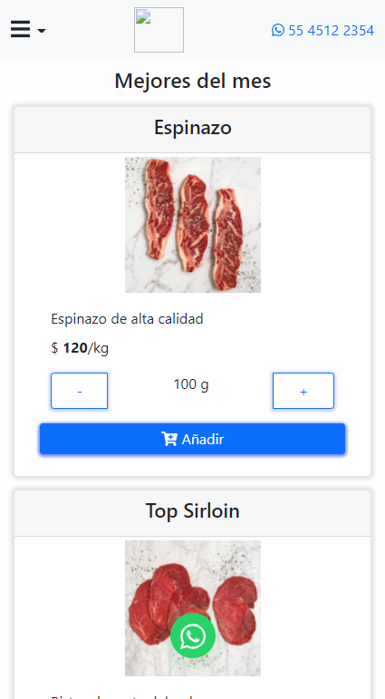
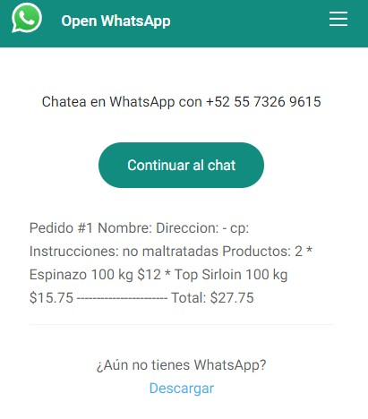
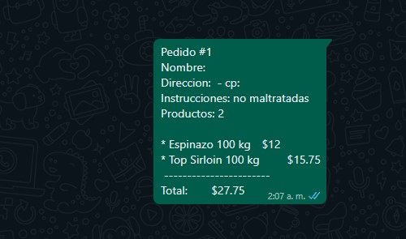
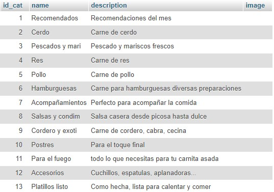
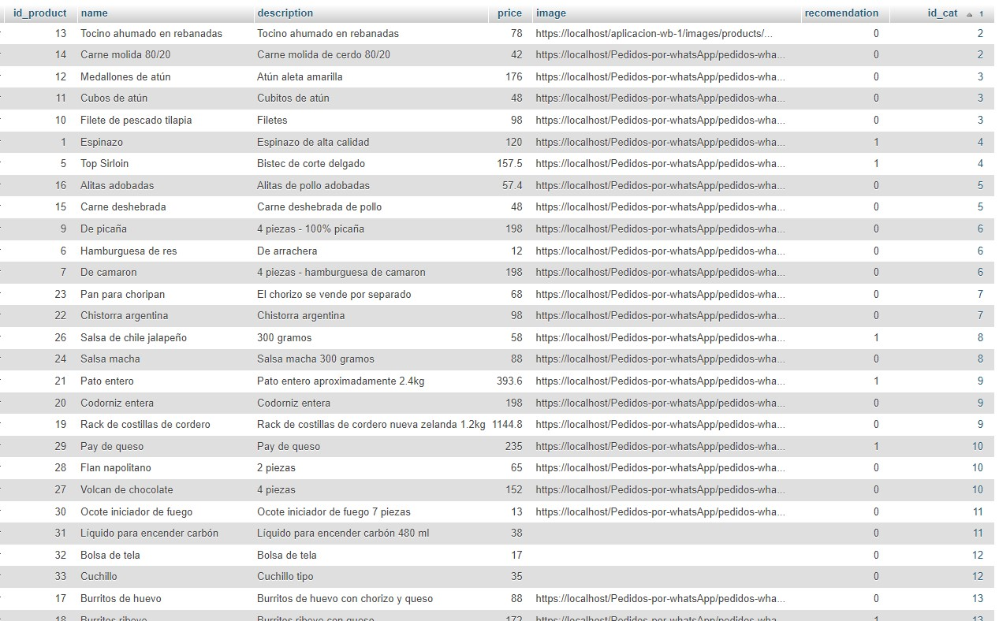

# Pedidos por whatsApp

Application to make orders and send them by whatsapp API. Design based on Single Page Applications. Created in php lenguage for use in shared hosting. Intended for free use.

User interface `desktop` version



User interface `mobile` version



## Working


Mobile version working


## How it works

Save the product id and weight selected or pieces selected in a cookie called CartJS created by JS code, if product already exists it added the new weith or piece to older one.
> Cookie value

```javascript
[{"id":1,"kg":100},{"id":5,"kg":100}]
```

In the form just recover basic information for the user and aditional instructions. When send order clicked use php code to concatenate url from whatsapp api <https://api.whatsapp.com/send?phone=phoneNumber&text=contentText>

Order structure



Order sended



## Database structure

**Restructuring, working but not scalable**

Using MySQL for dev and deploy (shared hosting).
Database just save products and categories, dont need to save orders or users info.





## For the next version

- Implementing admin dashboard
  - Simply authentication panel
  - Products and categories CRUD
  - Data modification telephone, logo, icon...
- Easy admin account creation, anyone will be able to use the store on their own servers.
  - Config php file
  - Data base creation
  - Demo store
  - User cretentials settings
- Unlock pickup and schedule order
- Improve UI/UX
